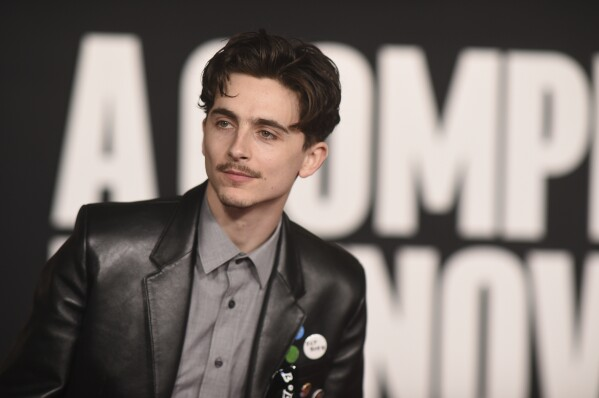
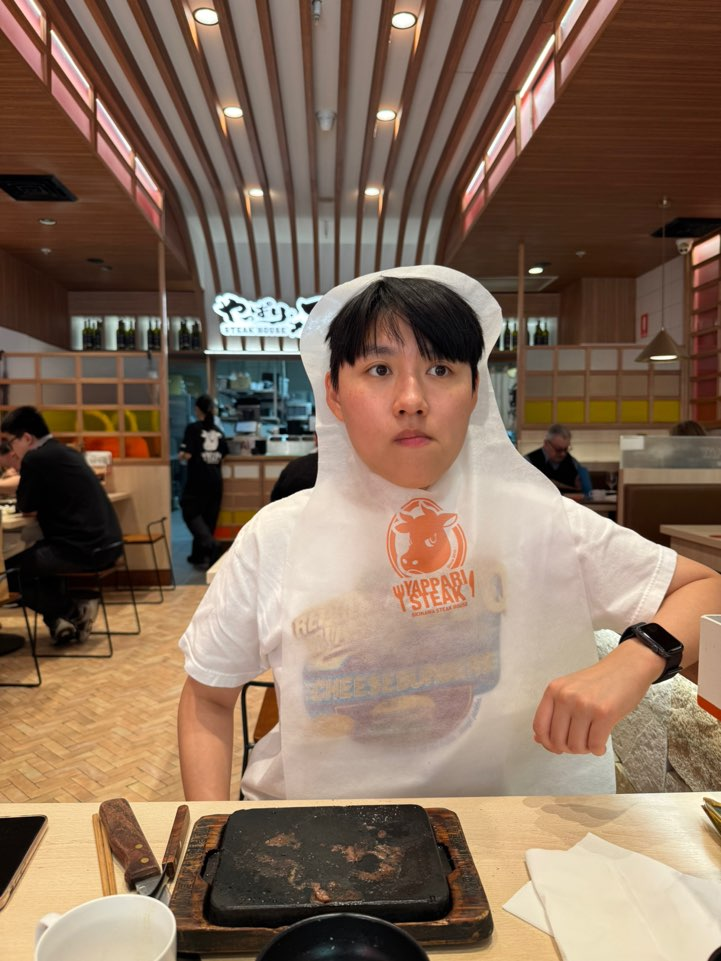
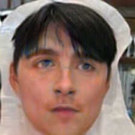
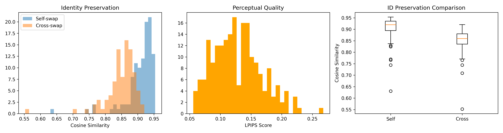

# FaceSwap LFW Fine-tune

Face swap implementation using SimSwap architecture, fine-tuned on the LFW (Labeled Faces in the Wild) dataset.

## Features

- **Face alignment** using InsightFace for robust preprocessing
- **Identity preservation** with ArcFace embeddings
- **FastAPI server** for image and video face swapping
- **Video stabilization** with optical flow and FFmpeg post-processing
- **LFW dataset fine-tuning** with self-swap and cross-swap sampling
- **WandB integration** for training visualization

## Requirements

- Python 3.9+
- PyTorch 2.2.2, torchvision 0.17.2
- InsightFace models (buffalo_l)
- FFmpeg (for video stabilization)

## Installation

```bash
pip install torch torchvision
pip install fastapi uvicorn
pip install insightface opencv-python pillow
pip install wandb tqdm lpips scikit-image matplotlib
```

Install FFmpeg:
```bash
# Ubuntu/Debian
sudo apt install ffmpeg

# macOS
brew install ffmpeg

# Windows
choco install ffmpeg
```

## Model Checkpoints

### Pre-trained Base Models

Download the required base models from the [official SimSwap preparation guide](https://github.com/neuralchen/SimSwap/blob/main/docs/guidance/preparation.md):

**Download**: [Google Drive - Base Models](https://drive.google.com/drive/folders/1jV6_0FIMPC53FZ2HzZNJZGMe55bbu17R)

Required files:
- `arcface_checkpoint.tar` → Place in `arcface_model/`
- Generator checkpoint → Place in `checkpoints/people/`

### Fine-tuned Model (LFW)

The fine-tuned model trained on LFW dataset:

**Download**: [Google Drive - Fine-tuned Model](https://drive.google.com/drive/folders/1En0fohchDCoaiAr174U85xCglAamBUh9?usp=sharing)

Place the checkpoint in `checkpoints/simswap/netG_step13000.pth`

## Project Structure

```
├── app/
│   ├── api.py              # FastAPI endpoints with stabilization
│   ├── inference.py        # Face swap pipeline
│   └── video.py            # Video processing with optical flow
├── data/
│   ├── data_loader_lfw.py  # LFW dataset loader
│   ├── face_align_utils.py # Face alignment utilities
    └── save_aligned.py     # Batch face alignment script
├── models/
│   ├── projected_model.py  # SimSwap model (main)
│   └── arcface_models.py   # ArcFace identity encoder
├── train.py                # Training script
└── evaluate.py             # Evaluation script
```

## Data Preparation
 
1. Download LFW dataset and place in `./lfw_funneled` </br>
👉 Alternatively, you can directly download the pre-aligned version here:  
   [Google Drive - LFW Aligned Dataset](https://drive.google.com/drive/folders/1xA7S2mwFZU1chJOUJb_69Q0lQ3Sa0uF9?usp=sharing)
2. Run face alignment preprocessing:

```bash
python save_aligned.py --src ./lfw_funneled --dst ./lfw_aligned_224 --size 224 --ctx 0
```

Arguments:
- `--src`: Input directory with person folders
- `--dst`: Output directory for aligned faces
- `--size`: Output image size (default: 224)
- `--ctx`: GPU device ID (0 for GPU, -1 for CPU)

## Training

```bash
python train.py \
  --name simswap \
  --batchSize 4 \
  --total_step 30000 \
  --lr 0.0004 \
  --lambda_id 30.0 \
  --lambda_feat 10.0 \
  --lambda_rec 10.0 \
  --Arc_path arcface_model/arcface_checkpoint.tar \
  --load_pretrain ./people \
  --gpu_ids 0
```

Key hyperparameters:
- `--lambda_id`: Identity loss weight (30.0)
- `--lambda_feat`: Feature matching loss weight (10.0)
- `--lambda_rec`: Reconstruction loss for self-swap (10.0)
- `--self_prob`: Probability of self-swap vs cross-swap (0.5)

Training features:
- Generator-only fine-tuning (discriminator frozen)
- Self-swap and cross-swap pair sampling
- ID cosine similarity tracking
- Adversarial loss warm-up after 10k steps

## Inference API

Start the FastAPI server:

```bash
uvicorn app.api:app --host 0.0.0.0 --port 8000
```

### Image Face Swap

```bash
curl -X POST http://localhost:8000/swap/image \
  -F "source=@source.jpg" \
  -F "target=@target.jpg" \
  -o output.png
```

### Video Face Swap

Basic usage with stabilization:
```bash
curl -X POST http://localhost:8000/swap/video \
  -F "source=@source.jpg" \
  -F "target=@video.mp4" \
  -o output.mp4
```

Adjust stabilization strength:
```bash
curl -X POST http://localhost:8000/swap/video \
  -F "source=@source.jpg" \
  -F "target=@video.mp4" \
  -F "smoothing=40" \
  -o output.mp4
```

Parameters:
- `smoothing`: Stabilization strength (10-50, default: 30)
- `enable_stabilization`: Enable/disable stabilization (default: true)

## Evaluation

Run quantitative evaluation on test set:

```bash
python evaluate.py
```

This computes:
- **Identity Similarity**: ArcFace cosine similarity (higher is better)
- **LPIPS**: Perceptual quality (lower is better)
- **Self-swap vs Cross-swap** comparison

## Results

### Image Examples

<table>
<tr>
<td><br/><i>Source</i></td>
<td><br/><i>Target</i></td>
<td><br/><i>Result</i></td>
</tr>
</table>

### Quantitative Results

Evaluation on 200 randomly sampled image pairs from LFW dataset:



| Metric | Self-swap | Cross-swap |
|--------|-----------|------------|
| ID Similarity (↑) | 0.91 ± 0.04 | 0.87 ± 0.06 |
| LPIPS (↓) | 0.13 ± 0.04 | 0.13 ± 0.04 |

The model achieves high identity preservation with moderate perceptual quality, demonstrating effective face swapping while maintaining source identity characteristics.

## Model Architecture

- **Generator**: SimSwap architecture with identity injection
- **Discriminator**: Multi-scale patch discriminator (frozen during fine-tuning)
- **Identity Encoder**: ArcFace ResNet-50

## Loss Functions

```
L_total = λ_adv * L_adv + λ_id * L_id + λ_feat * L_feat + λ_rec * L_rec
```

- **L_adv**: Adversarial loss (warm-up after 10k steps)
- **L_id**: Identity cosine similarity loss
- **L_feat**: Feature matching loss (layer 3)
- **L_rec**: Reconstruction loss (self-swap only)

## Video Stabilization

The video pipeline includes multiple stabilization techniques:

1. **Landmark EMA smoothing** (lm_beta=0.85)
2. **Identity latent EMA** (smooth=0.95)
3. **Optical flow blending** (flow_blend=0.3)
4. **FFmpeg vidstab post-processing**

This multi-stage approach significantly reduces jitter and temporal inconsistencies.

## Citation

If you use this code, please cite the original SimSwap paper:

```bibtex
@article{chen2020simswap,
  title={SimSwap: An Efficient Framework For High Fidelity Face Swapping},
  author={Chen, Renwang and Chen, Xuanhong and Ni, Bingbing and Ge, Yanhao},
  journal={arXiv preprint arXiv:2106.06340},
  year={2020}
}
```

## License
This project is for research purposes only.